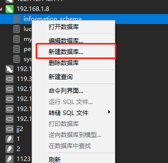

# luckyframe全部环境依赖

* mysql数据库 

# luckyframe搭建步骤

###  mysql数据库 
>**可以使用docker容器或者宿主机安装mysql**

1. **安装mysql**
2. **创建luckyframe数据库**
   - 命令行创建
        `CREATE DATABASE luckyframe`
   - navicat创建，右键连接内创建数据库即可
     
     

3. **创建luckframe用户**

```
CREATE USER 'luckyframe'@'%' IDENTIFIED BY 'luckyframe';
  
GRANT All privileges ON luckyframe.* TO 'luckyframe'@'%';
```
### 常见问题
        
>Q: **建立好的数据库navicat或者luckyframe服务端无法访问到怎么办**

>A: 检查下你开放的端口(默认3306)

```
 
  1. 使用 telnet ${ip} ${port}的方式判断下在网络环境中3306的可访问性
     例如 telnet 192.168.1.8 8080
  
  2. 先检查mysql是否设置了仅本机访问，查看mysqld.cnf文件(apt安装默认目录/etc/mysql/mysql.conf.d/mysqld.cnf)，如果
  bind-address = 127.0.0.1 这行没有注释，那么注释他之后重启mysql服务
  
  3. 第二步不行的话检查下本机的防火墙设置
      
```